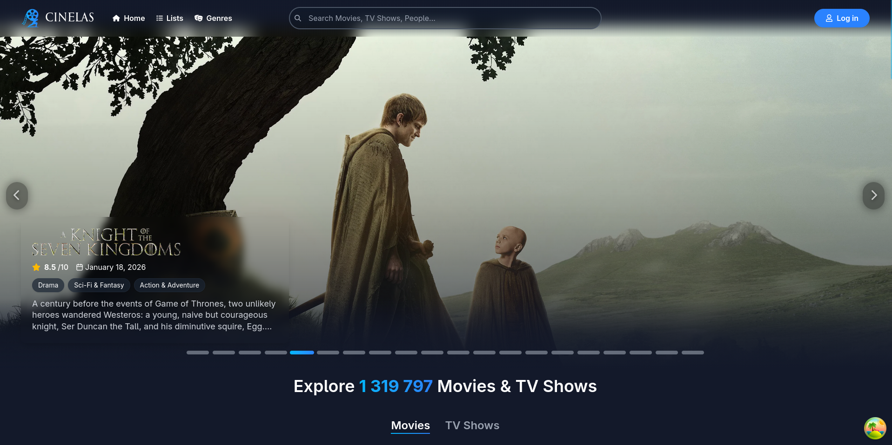

# Cinelas TV

**A self-hosted media browser for the living room.** TMDB metadata, your own media
library, and a D-pad-first interface that runs as a native app on Google TV /
Chromecast.



This is the TV variant of Cinelas — same domain model, rebuilt around a remote
control instead of a mouse.

## Tech Stack


## Architecture

The Raspberry Pi is the entire server; the TV runs UI only and holds no business
logic.

```
              TMDB API (metadata)
                     │
╔════════════════════╪════════════════════╗
║          Raspberry Pi 5 (ARM64)         ║
║                    │                    ║
║                  nginx                  ║
║        ┌───────────┼───────────┐        ║
║     React SPA  .NET API     Jellyfin    ║
║                    │            │       ║
║                PostgreSQL   Media SSD   ║
╚════════════════════╪════════════════════╝
                     │
        Google TV — Cinelas TV APK
             (React + Capacitor)
```

**Content sources are strictly separated:** TMDB supplies metadata only, and
playback is served exclusively by your own Jellyfin instance from media you
already own. There is no third-party stream scraping. The app works fine with no
Jellyfin key at all — playback endpoints simply report everything unavailable and
the Play buttons stay hidden.

## Features

- **Shelf-based browsing** — TMDB catalogue laid out as focusable D-pad rows
- **Jellyfin playback** — owned media resolved server-side; the client only ever
  sees proxied `/jellyfin/...` stream URLs
- **PIN + profiles sign-in** — household PIN and static profiles instead of OAuth,
  because nobody wants to type an email address with a remote
- **Per-profile lists & tracking** — Want to Watch / Watching / Watched, custom
  lists, and four-dimension reviews, all scoped per profile
- **Watch providers** — deep-link out to the services you subscribe to for
  anything not in your own library
- **Offline fallback** — the APK serves a bundled error page when the Pi is
  unreachable

## Quick Start

**Prerequisites:** Docker, a [TMDB API key](https://www.themoviedb.org/signup),
and optionally a media library (see [`media.example/`](./media.example/README.md)).

```bash
cp .env.example .env      # fill in at least TMDB_API_KEY
docker compose -f docker-compose.cinelas-tv.yml up -d --build
```

| Service | URL |
|---|---|
| App | http://localhost:8080 |
| Backend Swagger | http://localhost:8081/swagger |
| Jellyfin admin | http://localhost:8096 |

To enable playback, finish the Jellyfin setup wizard, point a library at `/media`,
create an API key under **Dashboard → API Keys**, and put it in `.env` as
`JELLYFIN_API_KEY`.

The stack runs over plain HTTP by design — it targets a trusted LAN and a TV
WebView, not exposure to the internet.

### Android TV app

`frontend/public/server.json` is the single source of truth for the URL the APK
loads. It defaults to `10.0.2.2:8080` (the Android emulator's alias for the host);
point it at the Pi's LAN address for a real device.

```bash
cd frontend
npm ci && npm run build
npx cap copy android
cd android && ./gradlew assembleDebug
adb install app/build/outputs/apk/debug/app-debug.apk
```

## Development

```bash
cd frontend && npm run dev        # Vite dev server
cd backend  && dotnet run         # API on https://localhost:7123
```

Tests: `npm test` (frontend), `dotnet test` (backend).
